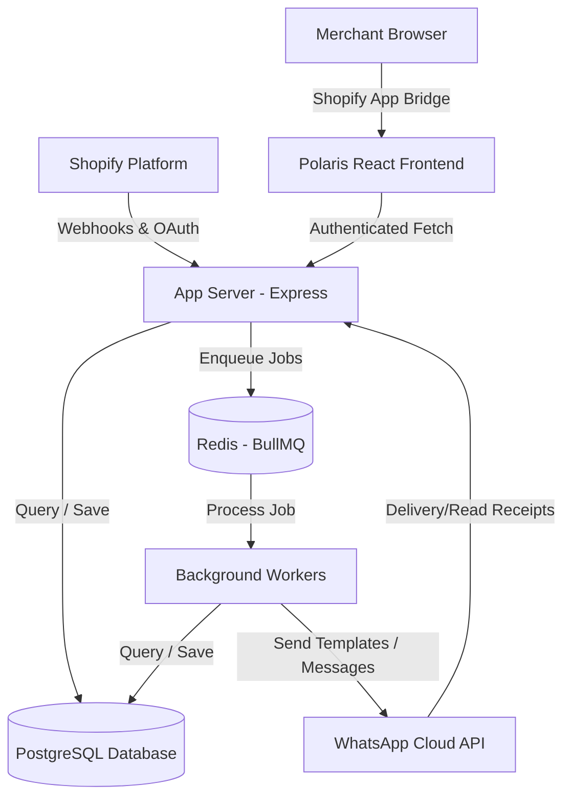

# Architecture Specification

## Overview

This document details the high-level architecture of the Shopify Embedded WhatsApp SaaS application. The architecture is designed for high throughput (specifically webhook handling and queueing) and strict security compliance.

## Reference System

- [Modules](file:///c:/Users/ravik/OneDrive/Desktop/shop/docs/Modules.md)
- [Roadmap](file:///c:/Users/ravik/OneDrive/Desktop/shop/docs/Roadmap.md)
- [Database](file:///c:/Users/ravik/OneDrive/Desktop/shop/docs/Database.md)
- [Security](file:///c:/Users/ravik/OneDrive/Desktop/shop/docs/Security.md)

---

## Architectural Principles

1. **SOLID Design Principles**: Every class and module has a single responsibility, interfaces define contracts, and modules are open for extension but closed for modification.
2. **Feature-Based Module Organization**: Instead of splitting by layer at the root (e.g., all controllers in one folder), files are grouped by logical feature modules (e.g., `whatsapp`, `campaigns`, `webhooks`).
3. **Clean Architecture / Separated Layers**:
   - **Domain / Entities**: Contains the core business models (interfaces, types).
   - **Repository Layer**: Handles all database access (Prisma). No business logic.
   - **Service Layer**: Orchestrates business workflows. Coordinates between repositories, outer services (WhatsApp, Shopify API), and queue workers.
   - **Controllers / Handlers**: HTTP endpoints (Express routes) that validate inputs, parse requests, and hand over to services.
4. **Asynchronous Execution (Worker/Queue Pattern)**:
   - High-volume events (webhooks, campaign message broadcasts) are pushed immediately to Redis via **BullMQ** queues.
   - Background workers process the queue asynchronously, preventing HTTP request timeouts and handling automated retries.

---

## System Topology

---

## Module Interfaces & Dependency Injection

To ensure decoupled layers, services depend on Repository interfaces. Dependency Injection (DI) is handled via clean construct/initialization functions or class-based injection.

- **ShopifyAuthService**: Handles OAuth redirects, offline token storage, and session validation.
- **WhatsAppService**: Interface for interaction with the Meta WhatsApp Cloud API.
- **CampaignService**: Coordinates contact lists, selected templates, scheduling, and message delivery.
- **WebhookHandler**: Parses, validates signatures, and routes incoming webhooks to queues.
